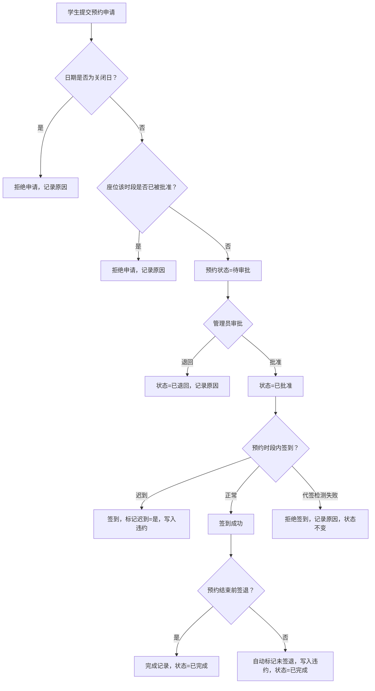

## 1. 产品概述
自习预约与签到系统，用于管理自习教室座位的预约、审批、签到和违约记录。
- 主要解决教室座位资源的合理分配与使用监管问题，目标用户为学生和管理员
- 产品价值：提升教室资源利用率，规范自习行为，减少违约行为

## 2. 核心功能

### 2.1 用户角色

| 角色 | 注册方式 | 核心权限 |
|------|----------|----------|
| 学生 | 系统预置/管理员创建 | 申请座位、签到签退、查看个人预约和违约历史 |
| 管理员 | 系统预置 | 审批预约、配置教室座位、设置开放时段、查看所有记录、统计导出、管理用户 |

### 2.2 功能模块
1. **登录页**：角色选择、账号登录
2. **学生仪表盘**：当前预约状态、快捷签到、预约历史、违约提示
3. **预约申请页**：选择教室、座位、时段，提交申请
4. **审批管理页**：待审批列表、批准/退回操作、审批原因
5. **教室座位配置页**：教室增删改、座位布局配置、开放时段设置、关闭日期配置
6. **签到签退页**：扫码/手动签到、签退、签到状态查看
7. **历史记录页**：按条件查询预约、签到、违约、审批记录
8. **统计导出页**：按学生/教室统计使用情况，导出 CSV

### 2.3 页面详情

| 页面名称 | 模块名称 | 功能描述 |
|----------|----------|----------|
| 登录页 | 登录表单 | 账号密码登录、角色切换、示例账号展示 |
| 学生仪表盘 | 预约卡片 | 显示当前进行中的预约，包含签到/签退按钮 |
| 学生仪表盘 | 违约提示 | 显示违约次数及对后续申请的影响 |
| 预约申请页 | 教室座位选择 | 可视化座位图，显示可用/已预约/不可用状态 |
| 预约申请页 | 时段选择 | 显示开放时段，排除关闭日期 |
| 审批管理页 | 待审批列表 | 分页展示待审批预约，显示学生信息、座位、时段 |
| 审批管理页 | 审批操作 | 批准、退回（需填写原因），操作日志记录 |
| 教室配置页 | 教室管理 | 增删改教室信息 |
| 教室配置页 | 座位配置 | 行列配置、座位编号生成、禁用座位 |
| 教室配置页 | 时段配置 | 开放时间段、关闭日期（节假日/维护日） |
| 签到签退页 | 签到操作 | 验证预约状态和身份，防止代签 |
| 签到签退页 | 签退操作 | 完成使用记录，计算使用时长 |
| 历史记录页 | 查询条件 | 按日期范围、学生、教室、状态筛选 |
| 历史记录页 | 操作日志 | 显示所有失败操作及原因 |
| 统计导出页 | 学生统计 | 按学生统计预约次数、签到率、违约次数 |
| 统计导出页 | 教室统计 | 按教室统计使用率、高峰时段 |
| 统计导出页 | 导出功能 | CSV 格式导出统计数据 |

## 3. 核心流程

### 预约与签到主流程
学生选择教室座位和开放时段提交申请 → 预约进入待审批状态 → 管理员审批（批准/退回）→ 批准后学生在预约时段内签到（验证身份，防止代签）→ 完成使用后签退 → 形成完整使用记录。

### 违约判定流程
- 迟到：超过预约开始时间 X 分钟未签到 → 标记迟到并写入违约记录
- 未签退：预约结束后仍未签退 → 标记未签退并写入违约记录
- 被退回：管理员退回申请 → 写入历史记录
- 违约次数影响：达到阈值后申请时弹出警示提示

### 异常拦截流程
- 关闭日期申请 → 拒绝申请，记录原因
- 同座位同时间重复批准 → 拒绝操作，记录原因
- 学生替别人签到 → 拒绝签到，记录原因
- 普通用户执行审批 → 权限校验失败，记录原因
- 以上异常操作均不改变原预约状态

## 4. 用户界面设计

### 4.1 设计风格
- 主色：深青色 teal-600，辅助色：琥珀色 amber-500，中性色：锌灰 zinc
- 按钮风格：圆角 8px，轻微阴影，悬停时浮起效果
- 字体：标题使用 Noto Serif SC 衬线字体增强学术感，正文使用系统无衬线字体
- 布局：左侧导航栏 + 主内容区的经典后台布局，卡片式信息展示
- 图标：Lucide 线性图标

### 4.2 页面设计概述

| 页面名称 | 模块名称 | UI 元素 |
|----------|----------|----------|
| 登录页 | 登录表单 | 居中卡片布局，深青渐变背景，输入框带图标 |
| 学生仪表盘 | 预约卡片 | 大圆角卡片，状态徽章，签到按钮脉冲动画 |
| 预约申请页 | 座位图 | 网格布局，不同状态座位颜色区分，悬停提示 |
| 审批管理页 | 审批列表 | 表格布局，行内操作按钮，状态标签 |
| 教室配置页 | 座位编辑器 | 可视化网格，拖拽/点击配置座位 |
| 统计导出页 | 统计图表 | 柱状图展示使用率，数据表格 + 导出按钮 |

### 4.3 响应式
桌面端优先设计（1280px+），平板端（768px）折叠侧边栏，移动端隐藏次要信息。
