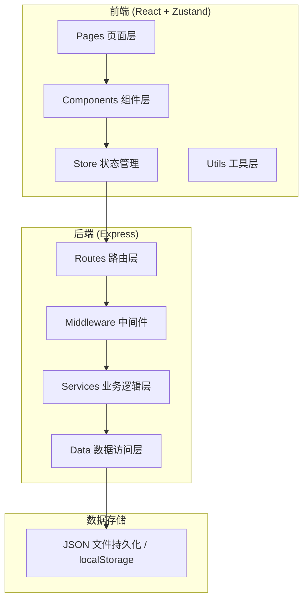
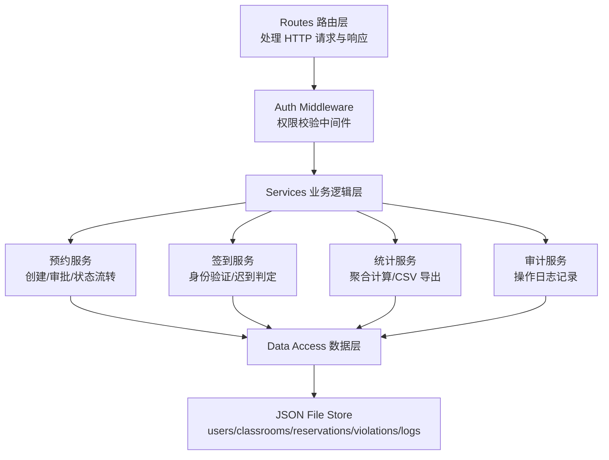
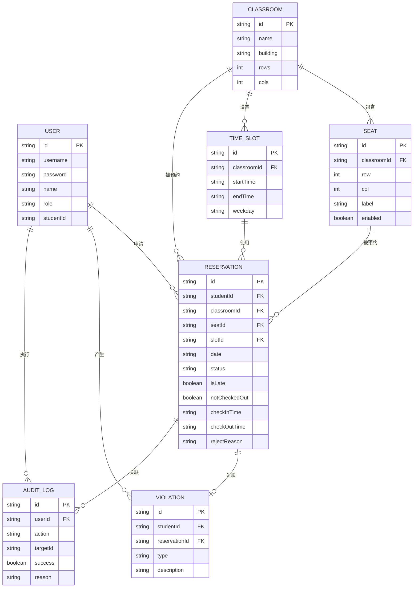

## 1. 架构设计



## 2. 技术描述
- 前端：React@18 + TypeScript + tailwindcss@3 + zustand + react-router-dom + lucide-react
- 初始化工具：vite-init
- 后端：Express@4 + TypeScript
- 数据库：JSON 文件持久化（便于本地复核，重启数据一致）
- 数据同步：前端 localStorage 缓存 + 后端 JSON 文件存储

## 3. 路由定义

### 前端路由

| 路由 | 用途 | 权限 |
|------|------|------|
| /login | 登录页 | 公开 |
| /dashboard | 仪表盘 | 登录用户 |
| /reserve | 预约申请 | 学生 |
| /approvals | 审批管理 | 管理员 |
| /classrooms | 教室座位配置 | 管理员 |
| /checkin | 签到签退 | 登录用户 |
| /history | 历史记录 | 登录用户 |
| /statistics | 统计导出 | 管理员 |

### 后端 API 路由

| 方法 | 路由 | 用途 |
|------|------|------|
| POST | /api/auth/login | 用户登录 |
| GET | /api/auth/me | 获取当前用户 |
| GET | /api/classrooms | 获取教室列表 |
| POST | /api/classrooms | 创建教室 |
| PUT | /api/classrooms/:id | 更新教室 |
| DELETE | /api/classrooms/:id | 删除教室 |
| GET | /api/classrooms/:id/seats | 获取教室座位 |
| PUT | /api/classrooms/:id/seats | 更新教室座位配置 |
| GET | /api/classrooms/:id/slots | 获取开放时段 |
| PUT | /api/classrooms/:id/slots | 更新开放时段 |
| GET | /api/closed-dates | 获取关闭日期 |
| PUT | /api/closed-dates | 更新关闭日期 |
| GET | /api/reservations | 获取预约列表 |
| POST | /api/reservations | 提交预约申请 |
| PUT | /api/reservations/:id/approve | 批准预约 |
| PUT | /api/reservations/:id/reject | 退回预约 |
| POST | /api/reservations/:id/checkin | 签到 |
| POST | /api/reservations/:id/checkout | 签退 |
| GET | /api/violations | 获取违约记录 |
| GET | /api/history | 获取历史记录 |
| GET | /api/statistics/students | 学生维度统计 |
| GET | /api/statistics/classrooms | 教室维度统计 |
| GET | /api/statistics/export | 导出统计数据 |
| GET | /api/audit-logs | 获取操作日志 |

## 4. API 类型定义

```typescript
// 用户
interface User {
  id: string;
  username: string;
  password: string;
  name: string;
  role: 'student' | 'admin';
  studentId?: string;
  createdAt: string;
}

// 教室
interface Classroom {
  id: string;
  name: string;
  building: string;
  capacity: number;
  rows: number;
  cols: number;
  seats: Seat[];
  createdAt: string;
}

// 座位
interface Seat {
  id: string;
  row: number;
  col: number;
  label: string;
  enabled: boolean;
}

// 开放时段
interface TimeSlot {
  id: string;
  classroomId: string;
  startTime: string; // "08:00"
  endTime: string;   // "10:00"
  weekday: number[]; // [1,2,3,4,5] 周一到周五
}

// 关闭日期
interface ClosedDate {
  date: string; // "2025-01-01"
  reason: string;
}

// 预约
interface Reservation {
  id: string;
  studentId: string;
  classroomId: string;
  seatId: string;
  date: string; // "2025-01-15"
  slotId: string;
  startTime: string;
  endTime: string;
  status: 'pending' | 'approved' | 'rejected' | 'checked_in' | 'completed' | 'cancelled';
  isLate?: boolean;
  notCheckedOut?: boolean;
  checkInTime?: string;
  checkOutTime?: string;
  approvedBy?: string;
  rejectReason?: string;
  createdAt: string;
  approvedAt?: string;
}

// 违约记录
interface Violation {
  id: string;
  studentId: string;
  reservationId: string;
  type: 'late' | 'no_show' | 'not_checked_out' | 'rejected';
  description: string;
  createdAt: string;
}

// 操作日志
interface AuditLog {
  id: string;
  userId: string;
  action: string;
  targetId?: string;
  success: boolean;
  reason?: string;
  createdAt: string;
}

// 统计
interface StudentStat {
  studentId: string;
  studentName: string;
  totalReservations: number;
  completedCount: number;
  checkInRate: number;
  violationCount: number;
}

interface ClassroomStat {
  classroomId: string;
  classroomName: string;
  totalSeats: number;
  utilizationRate: number;
  peakHours: string[];
}
```

## 5. 服务端架构图



## 6. 数据模型

### 6.1 ER 图



### 6.2 初始数据
- 预置用户：
  - 管理员：admin / admin123，姓名：系统管理员
  - 学生：student01 / 123456，姓名：张三，学号：2024001
  - 学生：student02 / 123456，姓名：李四，学号：2024002
- 预置教室：A101（5行6列30座）、B202（4行5列20座）
- 预置开放时段：08:00-10:00, 10:00-12:00, 14:00-16:00, 16:00-18:00（周一至周五）
- 系统配置：迟到阈值 15 分钟，违约警示阈值 3 次
